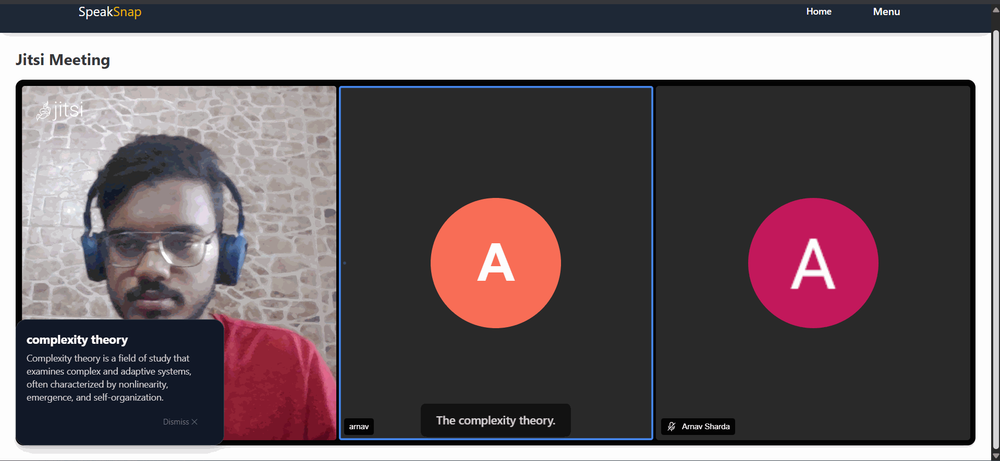

# SpeakSnap 🧠💬

**SpeakSnap** is an AI-powered meeting companion that enhances real-time conversations by identifying and summarizing domain-specific terms as you speak — helping everyone stay on the same page.

Perfect for technical discussions, onboarding sessions, or interdisciplinary meetings, SpeakSnap provides live contextual explanations of complex terms right inside your video call.

---

## ✨ Features

- 🗣️ **Real-time Audio Transcription** using Azure Speech-to-Text  
- 🧠 **Contextual Term Detection** with Google's Gemini API via LangChain  
- 💡 **Dynamic Popups** in the frontend to display term summaries live during meetings  
- 🎥 **Jitsi Meet Integration** for live video/audio conferencing  
- 📦 **Modular Architecture** split into Core (AI) and Suite (App)

---

## 🧱 Architecture Overview

| Component        | Description                                                                 |
|------------------|-----------------------------------------------------------------------------|
| **Core**         | Python module that uses Gemini + LangChain to process domain-specific terms |
| **Suite**        | JavaScript backend and frontend with Azure STT, Jitsi, and term popup UI    |

---

## 🚀 Getting Started

### 1. Clone the Repository

```bash
git clone https://github.com/your-org/speaksnap.git
cd speaksnap
````

---

## 🧠 Core (Gemini + LangChain) – `core/`

The **Core** handles all the AI-based processes, such as interacting with the Gemini API to detect and summarize domain-specific terms during the meeting.

### Setup

1. Navigate to the `core/` directory:

   ```bash
   cd core
   ```

2. Create and activate a virtual environment:

   ```bash
   python -m venv venv
   source venv/bin/activate        # On Windows: venv\Scripts\activate
   ```

3. Install dependencies:

   ```bash
   pip install -r requirements.txt
   ```

### Configure `.env`

Create a `.env` file in the `core/` directory with your **Google Gemini API key**:

```env
GOOGLE_API_KEY=your_google_gemini_api_key_here
```

### Run

Start the core service, which will handle term detection and summarization:

```bash
python main.py
```

---

## 💻 Suite (Backend + Frontend) – `suite/`

The **Suite** is responsible for the frontend UI and the backend WebSocket server that connects to the core service.

### 🔧 Backend Setup

1. Navigate to the `suite/backend` directory:

   ```bash
   cd suite/backend
   ```

2. Install dependencies:

   ```bash
   npm install
   ```

   If you face any issues, try:

   ```bash
   npm install vite@4.0.0
   ```

### Configure `.env`

Create a `.env` file in `suite/backend/` with the following environment variables:

```env
MONGO_URI=your_mongodb_connection_string
AZURE_SPEECH_KEY=your_azure_speech_key
AZURE_REGION=your_azure_region
```

### Start Backend

Start the backend WebSocket server, which will handle real-time speech-to-text data and interact with the Core:

```bash
node server.js
```

---

### 🎨 Frontend Setup

1. Navigate to the `suite/frontend/SpeakSuit` directory:

   ```bash
   cd suite/frontend/SpeakSuit
   ```

2. Install dependencies:

   ```bash
   npm install
   ```

   If any issues arise, try:

   ```bash
   npm install vite@4.0.0
   ```

### Run Frontend

Start the frontend React app, which will display live term summaries in the meeting:

```bash
npm run dev
```

The app will be available at [http://localhost:5173](http://localhost:5173).

---

## 🌍 Hosted API Server

Due to some technical difficulties, we have only hosted the **API server** at the following URL:

* **API Endpoint:** [http://52.23.182.233:8080/api/summary/](http://52.23.182.233:8080/api/summary/)

### Request JSON Schema

The API accepts the following JSON request schema:

```json
{
  "text": "string",
  "userid": "string",
  "sessionid": "string"
}
```

### Response JSON Schema

The response schema is as follows:

```json
{
  "title": "Summary",
  "type": "object",
  "properties": {
    "summary": {
      "type": "string",
      "description": "An overall summary of the entire chat history until the most recent query, in as few lines as possible but make sure to the major components of old text as well"
    },
    "sentiment": {
      "type": "string",
      "enum": ["pos", "neu", "neg"],
      "description": "Return the sentiment of the conversation as positive, neutral, or negative"
    },
    "name": {
      "type": ["string", "null"],
      "description": "The speaker's name, if available. Use null if the speaker is unidentified or not mentioned in the text."
    },
    "contextual_explanations": {
      "type": "array",
      "items": {
        "type": "object",
        "properties": {
          "term": {
            "type": "string",
            "description": "A term or phrase used in the conversation that might require explanation—this includes pop culture references (e.g., TV shows, movies), scientific terms, financial or economic concepts, historical or political references, technical jargon, or any other potentially unclear or domain-specific expression."
          },
          "explanation": {
            "type": "string",
            "description": "A concise explanation of the term in the context it was used, aimed at someone who may not be familiar with it."
          }
        },
        "required": ["term", "explanation"]
      },
      "description": "List of all terms or phrases in the conversation that could benefit from contextual explanation, regardless of their domain."
    }
  },
  "required": ["summary", "sentiment"]
}
```

---

## ✅ Workflow Summary

1. Start the **Core** service (`python core/main.py`)
2. Start the **Suite** backend (`node suite/backend/server.js`)
3. Start the **Suite** frontend (`npm run dev` inside `suite/frontend/SpeakSuit`)
4. Join a Jitsi meeting and speak — watch contextual definitions appear live!

---

## 📄 Repositories

* [🧠 speaksnap-core (Python)](https://github.com/SiddharthKarmokar/SpeakSnap-core.git) – Gemini + LangChain backend
* [💻 speaksnap-suite (JS)](https://github.com/SiddharthKarmokar/SpeakSnap-suite.git) – Backend (Node.js) and Frontend (React)

---

### 🖼 Preview:
---

---

## 📄 License

MIT License – See individual folders for details.

---

## 👥 Contributors
- [**Siddharth Karmokar**](https://github.com/SiddharthKarmoka) (Backend Api Server)
- [**Arnav Sharda**](https://github.com/arnav7897) (Frontend Developer)
- [**Rushikesh Iche**](https://github.com/RushikeshIche) (Backend Developer)
